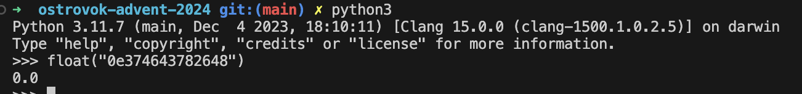

# Несанкционированное застолье

В исходнике кода должно насторожить следующее - пароли для всех пользователей классические - хэш, а пароль для админа почему-то обернут во float()

Более того, имеются комментарии с наглядным результатом функции хэша на пароль, и искомый точно начинается с 0e 

Дело в том, что когда строка интерпретируется как число с плавающей точкой, число с плавающей точкой затем преобразуется в целое число 0. Таким образом, целое число 0 всегда равно числу с плавающей точкой 0e4, полученному из строки «0e4» (И любые другие варианты, после 0е можно написать сколь угодно много цифр)

Это можно проверить в интерпретаторе python:

**Значит, наш пароль для админа после всех преобразований на бэке будет равен НУЛЮ**

Пароль, который вы введете для админа на веб-странице, тоже будет преобразован в хэш и в float(), но если вы попробуете преобразовать случайный хэш в float(), то скорее всего получите TypeError - в хэше используются латинские буквы, и число с плавающей точкой из него сделать нельзя. Исключение составляет наше "0e*******"

Но, раз в хэше могут быть символы от 0 до 9, от A до F, то можно подобрать такую строку, что хэш будет состоять из одних лишь цифр. Также, после преобразования во float() он тоже должен быть равен нулю, следовательно, начинаться с 0e

В скрипте-решении предоставлен пример перебора чисел, удовлетворяющих условиям:

1) Хэш начинается с 0e
2) Хэш, кроме второго символа, состоит из одних лишь цифр

Найденное число вводим как пароль и радуемся жизни

Подробнее:

https://web.archive.org/web/20150530075600/http://blog.astrumfutura.com/2015/05/phps-magic-hash-vulnerability-or-beware-of-type-juggling/

